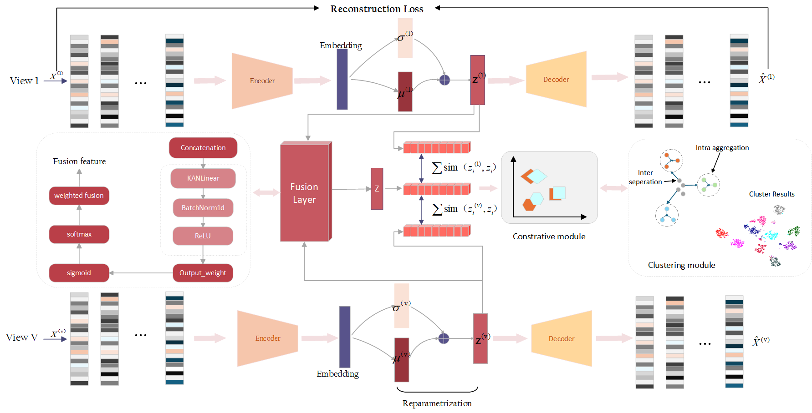

# ARLIMVC: Adaptive Representation Learning Framework for Incomplete Multi-View Clustering

## Intro

This repository contains the code of our paper **Adaptive Representation Learning Framework for Incomplete Multi-View Clustering (ARLIMVC)**.

ARLIMVC is a deep incomplete multi-view clustering framework built on a variational autoencoder architecture. It integrates three key components: a **mutual information-guided data recovery module**, a **dual-constraint representation alignment module**, and a **KAN-based weighted representation fusion module** to learn robust and discriminative representations from incomplete multi-view data.

> **Adaptive Representation Learning Framework for Incomplete Multi-View Clustering**



## Highlights

- **Mutual information-guided data recovery** for adaptive missing-view reconstruction.
- **Dual-constraint representation alignment** to enhance both cross-view consistency and intra-view compactness.
- **KAN-based weighted fusion** to dynamically capture the contribution of different views.
- **End-to-end optimization** with VAE-based representation learning and clustering refinement.

## Datasets

The datasets used in our paper include **COIL20**, **100leaves**, **Handwritten**, **MSRC**, **ORL**, **Scene-15**, and **ALOI-100**.  
In the current public implementation, we provide the default configuration for **COIL20**.

## Requirements

Recommended environment:

- Python 3.8+
- PyTorch
- NumPy
- SciPy
- scikit-learn
- matplotlib
- seaborn
- hnswlib
- munkres

You can install the main dependencies with:

```bash
pip install torch numpy scipy scikit-learn matplotlib seaborn hnswlib munkres
